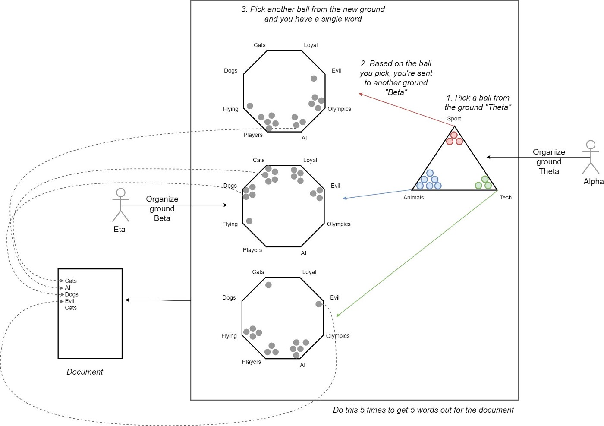
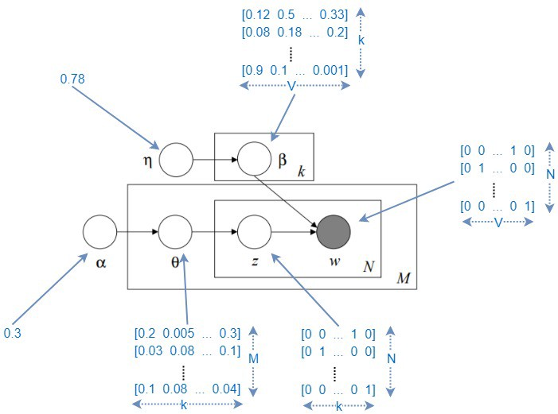

---
output:
  xaringan::moon_reader:
    lib_dir: libs
    nature:
      highlightStyle: github
    css: ["style.css"]
---

class: center, middle

# Section VII: LDA and Text Scraping

.course[450C]

.institution[__Stanford University__ 

Department of Political Science  
  
---  

Toby Nowacki

Zuhad Hai]

---

---

# Overview

1. Overview

2. Midterm Recap

3. Latent Dirichlet Allocation

4. Text Scraping using rvest

---

# Midterm Recap

* Everyone did well!

* Mean of 86

* Median of 88.5

---

# Midterm Recap

* The variance-bias tradeoff is inherent in **any** model that we fit. 

* Whether we prioritise reducing MSE or Bias depends entirely on the task at hand

  * In causal inference, we still care a lot about the bias term.
  * Model choice will depend on whether we want to infer effect size ( $\hat{\beta}$ ) or make good predictions ( $\hat{y}$ ).

* Machine Learning is *not* a panacea to all of our problems

* Fitting the same model (e.g., LASSO) with slightly different options can give you very different results!

---

# Latent Dirichlet Allocation

* The idea is to build a hierarchical model to predict probabilities of each document belonging to different clusters.

* LDA setup is very notation-heavy. (Notation slightly different from Justin's slides)

  * We have $K$ topics, $M$ documents, $1, \ldots, i, \ldots, N$ words in each document

$$\begin{align*}
  \underset{1 \times K}{\alpha} \\
  \underset{1 \times K}{\theta_m} & \sim \mathrm{Dir}(\underset{1 \times K}{\alpha}) \\
  \underset{1 \times K}{z_{im}} | \underset{1 \times K}{\theta_m} & \sim \mathrm{Multinomial}(\underset{1 \times K}{\theta_m}) \\
  \underset{1 \times N}{\beta_k} & \sim \mathrm{Dir}(\mathbf{1}) \\
  \underset{1 \times 1}{x_{im}} | \underset{1 \times N}{\beta_k}, z_{imk} = 1 & \sim \mathrm{Multinomial}( \underset{1 \times N}{\beta_k} )
\end{align*}$$

---

# Latent Dirichlet Allocation (cont'd)

* We can depict the hierarchy using a more intuitive setting:

```{r, out.width = "70%", echo = FALSE}
library(knitr)

```

---

# Latent Dirichlet Allocation (cont'd)

* Let's formalise the process a little bit, using plate notation.

```{r, out.width = "70%", echo = FALSE}
library(knitr)

```

---

# Latent Dirichlet Allocation (cont'd)

* $\theta_m$ (what Justin calls $\pi_i$ in his slides) is the vector that describes the probability of a document belonging to each topic.

* $\beta_{k}$ (what Justin calls $\theta_k$ in his slides) is the vector that describes the probability of word $i$ conditional on topic $k$. 

* We have the theoretical model -- how do we compute these quantities?

  * Joint posterior can be approximated using Gibbs sampling.
  * $\rightarrow$ far deeper dive into material in 450D (Bayesian statistics)

* The neat feature of LDA is that topics and words are interdependent!

---

# Application: Brexit-related speeches in British Parliament

* To the Code! $\rightarrow$ `EXAMPLE (Brexit LDA)`

---

# How to Get Text (Or Other Data)?

* Scrape from websites
  * use `beautifulSoup` in Python or `rvest` in `R`
  * easiest if provided data are accessible
  * with large datasets, hard to do (timeout and bandwidth problems)
  * scraping is significantly easier if you can discover regularities in the source data $\rightarrow$ `EXAMPLE (local elections)`

---

# How to Get Text (Or Other Data)? (cont'd)


* Example use case for `rvest`:

```
library(rvest)
lego_movie <- read_html("http://www.imdb.com/title/tt1490017/")

rating <- lego_movie %>% 
  html_nodes("strong span") %>%
  html_text() %>%
  as.numeric()
rating
#> [1] 7.8

cast <- lego_movie %>%
  html_nodes("#titleCast .primary_photo img") %>%
  html_attr("alt")
cast
#>  [1] "Will Arnett"     "Elizabeth Banks" "Craig Berry"    
#>  [4] "Alison Brie"     "David Burrows"   "Anthony Daniels"
#>  [7] "Charlie Day"     "Amanda Farinos"  "Keith Ferguson" 
#> [10] "Will Ferrell"    "Will Forte"      "Dave Franco"    
#> [13] "Morgan Freeman"  "Todd Hansen"     "Jonah Hill"
```

---

# How to Get Text (Or Other Data)? (cont'd)

* Scrape from pdfs
  * if text is machine-readable, use `pdftools` or `tabula`
  * if text is not recognised, use OCR software (e.g., `FineReader`)

* Bottom line: Original data easy to get once you're familiar with the tools!


